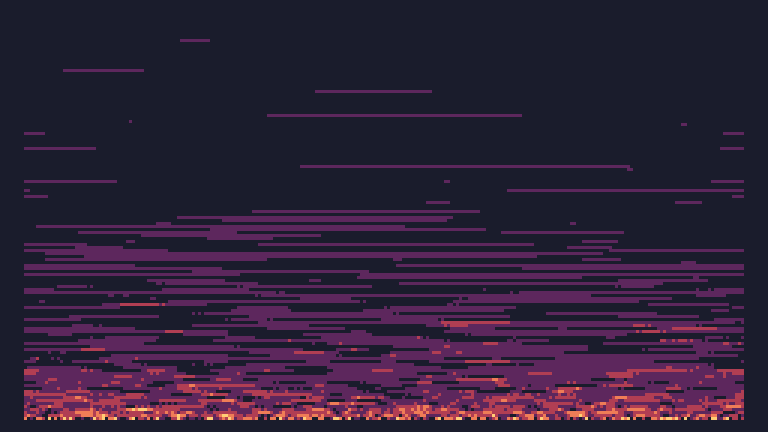

# Day 1 Extra


```
w=240
h=135

function TIC()
	for i=0,w*h do
		x=i%w 
		y=i//w 
		
		l=3*y/h
		c=math.random(5)-1
		if c > l then 
			c=0 
		end
		
		for j=-1,1 do 
			c=c+pix((x+j)%w,y+1)
		end 
		
		pix(x,y,c//3)
	end 
    
	for i=0,w do 
		pix(i,h,math.random(5)-1)
	end
end
```

and a size optimised version (192 characters)

```
w=240h=135r=math.random function TIC()for i=0,w*h do x=i%w y=i//w l=3*y/h c=r(5)-1if c>l then c=0 end for j=-1,1 do c=c+pix((x+j)%w,y+1)end pix(x,y,c//3)end for i=0,w do pix(i,h,r(5)-1)end end
```
