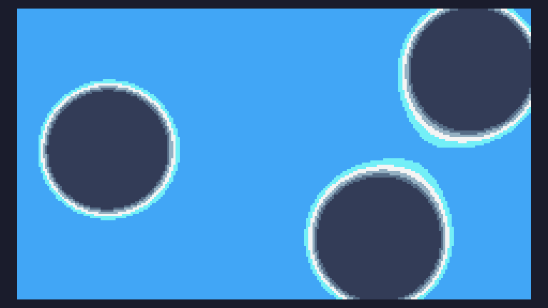

# Day 2 Extra


```
m=math 

w=240 
h=136

function TIC()
	for i=0,w*h do
		x=i%w
		y=i//w
		
		c=0
		for b=1,3 do
			a=b*2.56*m.pi/3
			s=b*1412+time()/7700
			
			u=w/2+m.sin(a+3.12*s)*((w/2)-27)
			v=h/2+m.sin(a+2.54*s)*((h/2)-27)
			
			c=c+h*w/3/((x-u)*(x-u)+(y-v)*(y-v))
		end
		
		pix(x,y,m.min(m.max(c,10),15))
	end
end
```

and a size optimised version (252 characters)

```
m=math h=136w=240 function TIC()for i=0,w*h do x=i%w y=i//w c=0 for b=1,3 do a=b*2.56*m.pi/3s=b*1412+time()/7700u=w/2+m.sin(a+3.12*s)*((w/2)-27)v=h/2+m.sin(a+2.54*s)*((h/2)-27)c=c+h*w/3/((x-u)*(x-u)+(y-v)*(y-v))end pix(x,y,m.min(m.max(c,10),15))end end
```
