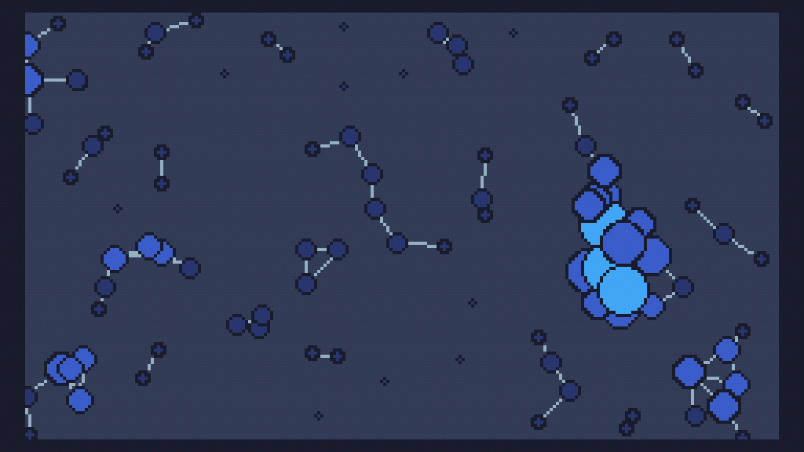

# Day 3 Extra


```
m=math
r=m.random

w=240
h=136

x={}
y={}

u={}
v={}

c={}

n=100 

for i=1,n do 
	x[i]=r(w)
	y[i]=r(h)
	
	u[i]=(r(n)-n/2)/n 
	v[i]=(r(n)-n/2)/n 
	
	c[i]=0 
end 

function TIC()
	cls(15)
	
	for i=1,n do 
		for j=1,n do 
			a=x[j]-x[i]
			b=y[j]-y[i]
			if a*a+b*b < 256 then 
				c[i]=c[i]+1
				line(x[j],y[j],x[i],y[i],13)
			end
		end
	end	
	
	for i=1,n do 
		circ(x[i],y[i],c[i],0)
		circ(x[i],y[i],c[i]-1,8+m.min(c[i]/4,4))
		
		x[i]=(x[i]+u[i])%w
		y[i]=(y[i]+v[i])%h 
		
		c[i]=0 
	end

end
```

and a size optimised version (400 characters)

```
m=math r=m.random w=240h=136x={}y={}u={}v={}c={}n=100 for i=1,n do x[i]=r(w)y[i]=r(h)u[i]=(r(n)-n/2)/n v[i]=(r(n)-n/2)/n c[i]=0 end function TIC()cls(15)for i=1,n do for j=1,n do a=x[j]-x[i]b=y[j]-y[i]if a*a+b*b < 256then c[i]=c[i]+1line(x[j],y[j],x[i],y[i],13)end end end	for i=1,n do circ(x[i],y[i],c[i],0)circ(x[i],y[i],c[i]-1,8+m.min(c[i]/4,4))x[i]=(x[i]+u[i])%w y[i]=(y[i]+v[i])%h c[i]=0 end end
```
