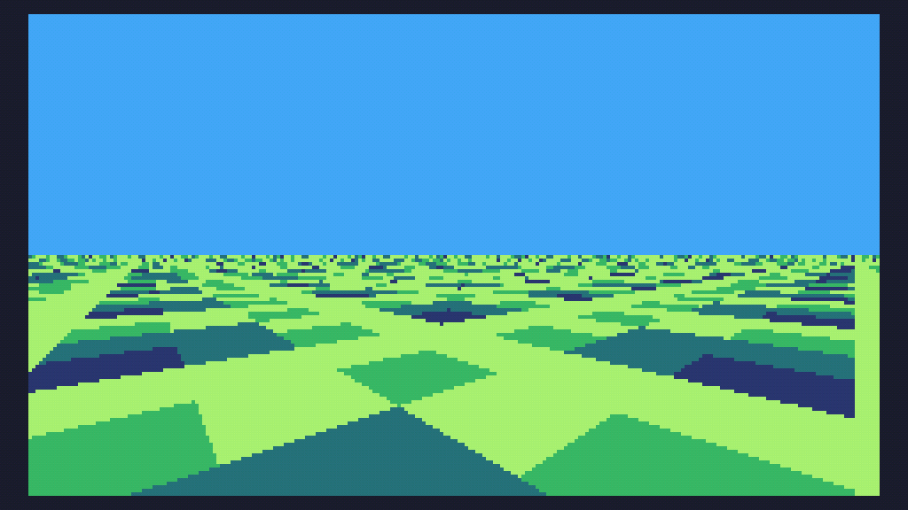

# Day 5 Extra


```
s=math.sin

w=240
h=68

t=0

function TIC()
	cls(10)

	for i=0,w*h do
		x=i%w
		y=i//w
		z=y+0.1
		
		q=(x-w/2)/z
		p=99/z
		o=s(t-11)
		
		u=o*q-s(t)*p
		v=s(t)*q+o*p 
		
		c=(u+t*3)//1&v//1
		pix(x,y+h,5+(c&3))
	end
	
	t=t+.02
end
```

and a size optimised version (184 characters)

```
s=math.sin w=240h=68t=0 function TIC()cls(10)for i=0,w*h do x=i%w y=i//w z=y+0.1q=(x-w/2)/z p=99/z o=s(t-11)u=o*q-s(t)*p v=s(t)*q+o*p c=(u+t*3)//1&v//1pix(x,y+h,5+(c&3))end t=t+.02 end
```
