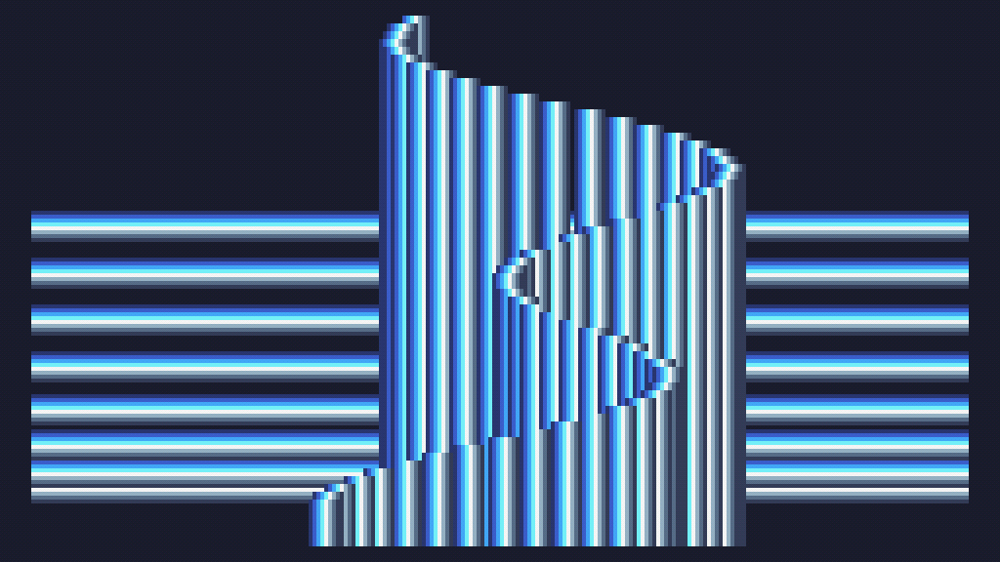

# Day 6 Extra


```
w=120
h=68

s=math.sin
l=line 

t=0 

function TIC()
	cls()

 for i=1,63 do
  x=i%8
  y=i//8
		z=h+x+s(t+y/4)*50
		l(0,z,w*2,z,x+8)
 end

 for i=1,503 do
  x=i%8
  y=i//8 
  z=x+w+s(y/13+t/4)*s(y/7+t)*60
  l(z,y*2,z,h*2,x+8)
 end 
 
 t=t+.03 
end
```

and a size optimised version (200 characters)

```
w=120h=68s=math.sin l=line t=0 function TIC()cls()for i=1,63 do x=i%8y=i//8z=h+x+s(t+y/4)*50l(0,z,w*2,z,x+8)end for i=1,503 do x=i%8y=i//8z=x+w+s(y/13+t/4)*s(y/7+t)*60l(z,y*2,z,h*2,x+8)end t=t+.03 end
```
