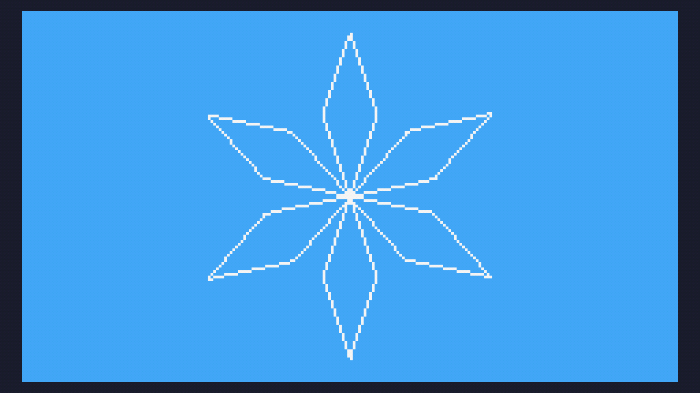

# Day 7 Extended


```
m=math
s=m.sin

w=120
h=68
a=30
b=10

t=0

function TIC()
 cls(10)

 for j=0,6 do
 	x={w,w-b,w,w+b,w}
		y={h,h-a,h-a*2,h-a,h}
 
 	c=t+j*m.pi/3  
 
 	for i=1,8 do
			if i<5 then
   	u=x[i]-w
   	v=y[i]-h
   	x[i]=w+s(c-11)*u-s(c)*v
  		y[i]=h+s(c)*u+s(c-11)*v
   else
   	k=i-4
   	line(x[k],y[k],x[k+1],y[k+1],12)
   end
  end
 end
	
 t=t+0.04
end
```
