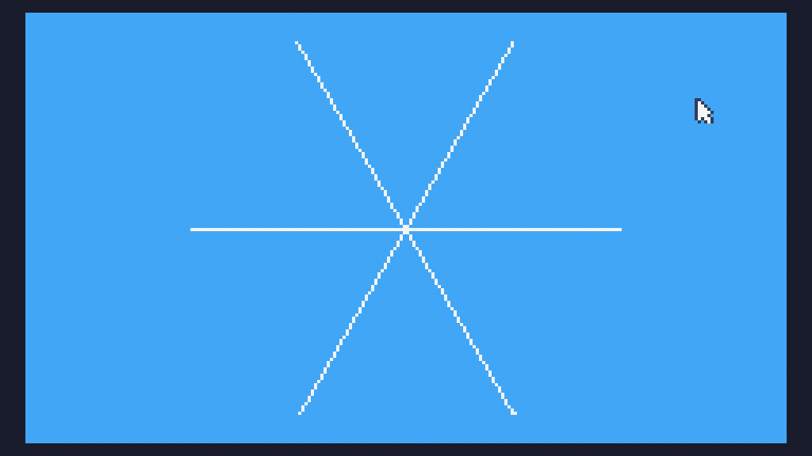

# Day 5 Extra


```
m=math
s=m.sin 

w=120
h=68 

function TIC()
	cls(10)
	
	for j=0,6 do
		t=j*m.pi/3
		line(w,h,w+s(t-11)*h,h+s(t)*h,12)
	end
end
```

and a size optimised version (109 characters)

```
m=math s=m.sin w=120h=68 function TIC()cls(10)for j=0,6 do t=j*m.pi/3line(w,h,w+s(t-11)*h,h+s(t)*h,12)end end
```
