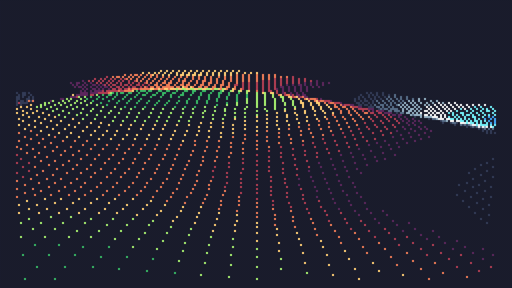

# Day 9 Extra


```
s=math.sin

t=0

p=120
q=1200

function TIC()
	cls()

	for x=-p,p,3 do
		for z=0,1000,8 do
			y=(s(s(t/2)+x/50)*3+s(z/50-t))*3
			d=q/(z*1.8-q)
			pix(p+x*d,(y-40)*d,y/1.8)
		end
	end

	t=.02+t
end
```

and a size optimised version (169 characters)

```
s=math.sin t=0p=120q=1200 function TIC()cls()for x=-p,p,3 do for z=0,1000,8 do y=(s(s(t/2)+x/50)*3+s(z/50-t))*3 d=q/(z*1.8-q)pix(p+x*d,(y-40)*d,y/1.8)end end t=.02+t end
```
