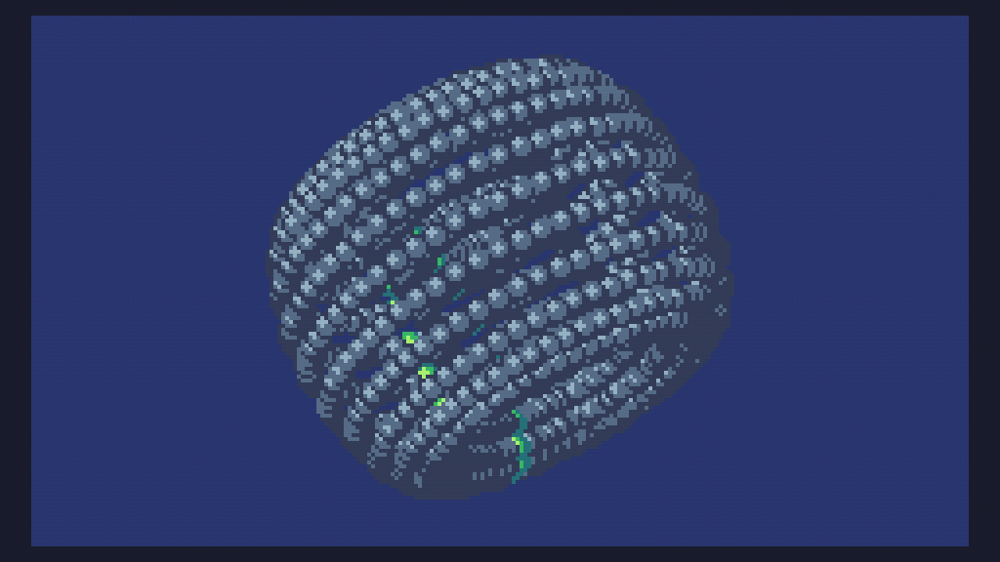

# Day 9 Extra


```
M=math
S=M.sin
C=M.pi*2

i=22
k=60
r=11
R=25 

N=0

function TIC()
	T=M.floor((time()/1000)%k)
	
	P={}
	for q=0,i*k do 
		u=q//k 
		v=q%k 
		U=C*u/i
		V=C*v/k
		
		x=(R+r*S(U-r))*S(V-r)
		y=(R+r*S(U-r))*S(V)
		z=R*S(U)s=S(N)c=S(N-r)
		
		I=x*c-y*s
		J=x*s+y*c
		K=J*s+z*c 
		
		D=15
		if T==v then 
			D=7
		end 
		
		P[#P+1]={x=I*c-K*s, y=J*c-z*s, z=I*s+K*c+400, c=D}
	end	
	
	table.sort(P,function(a,b)
		return a.z>b.z end)
		
	cls(8)
	
	for p=1,#P do
		for w=0,2 do
			circ(P[p].x*600/P[p].z+120-w/2,P[p].y*600/P[p].z+68-w/2,3-w,P[p].c-w)
		end 
	end 
	
	N=N+.01 
end
```

and a size optimised version (465 characters)

```
M=math S=M.sin C=M.pi*2i=22k=60r=11R=25N=0 function TIC()T=M.floor((time()/1000)%k)P={}for q=0,i*k do u=q//k v=q%k U=C*u/i V=C*v/k x=(R+r*S(U-r))*S(V-r)y=(R+r*S(U-r))*S(V)z=R*S(U)s=S(N)c=S(N-r)I=x*c-y*s J=x*s+y*c K=J*s+z*c D=15if T==v then D=7 end P[#P+1]={x=I*c-K*s,y=J*c-z*s,z=I*s+K*c+400,c=D}end	table.sort(P,function(a,b)return a.z>b.z end)cls(8)for p=1,#P do for w=0,2 do circ(P[p].x*600/P[p].z+120-w/2,P[p].y*600/P[p].z+68-w/2,3-w,P[p].c-w)end end N=N+.01 end
```
